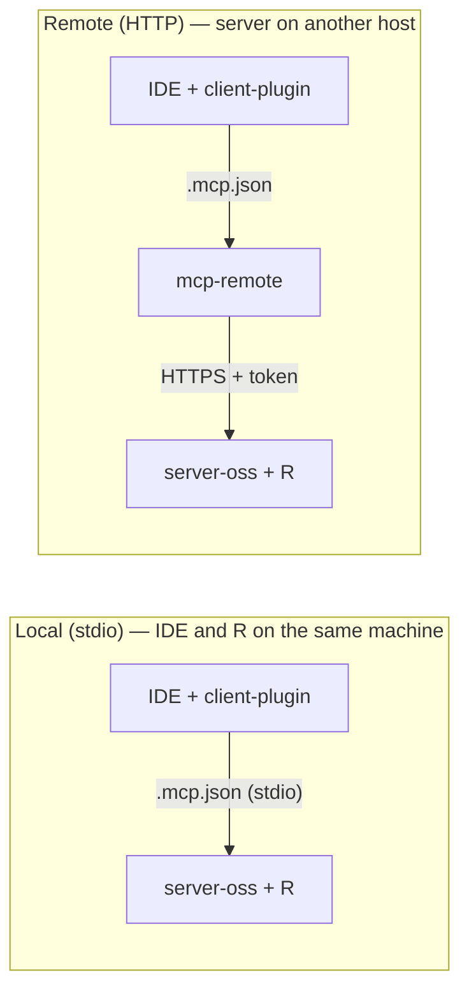
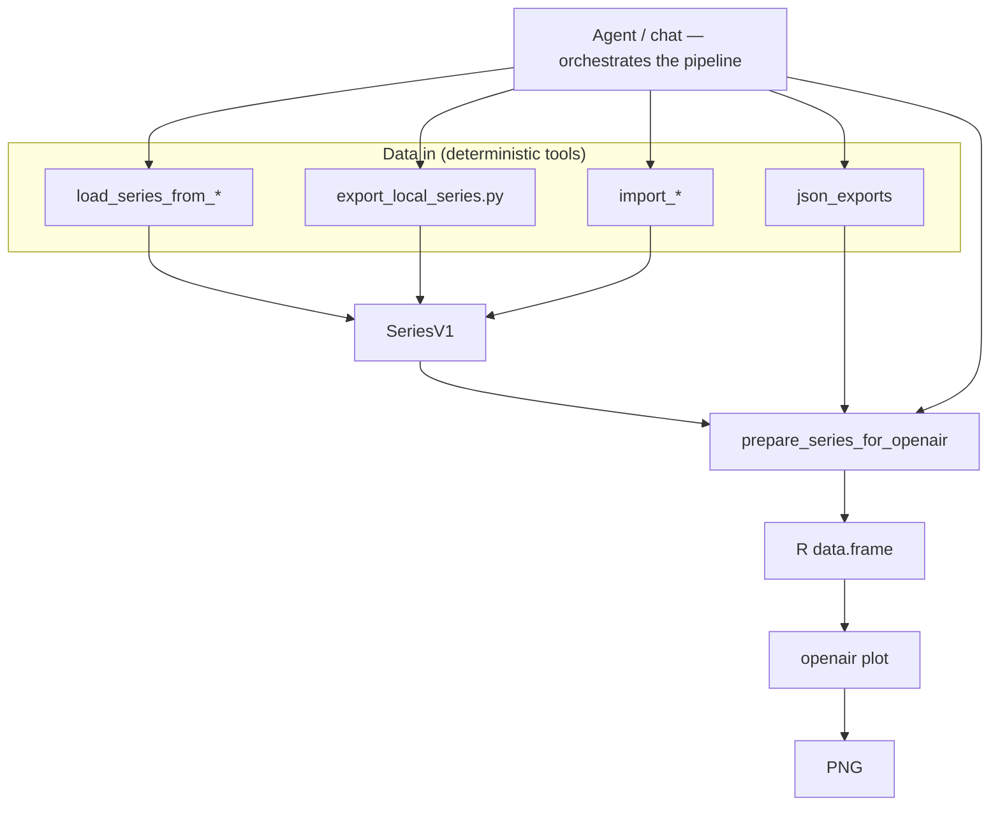

# openair-3-mcp-server-oss

[](LICENSE)

**The server** — run on any machine with R (your laptop, lab VM, or cloud). MCP clients connect via **stdio** (local) or **HTTP** (local `127.0.0.1` or remote host via `mcp-remote`).

Give your AI agent the ability to analyse air quality — import public networks, load CSV exports, and produce publication-grade openair charts from chat.

Pair with **the client plugin** for your IDE: [openair-3-mcp-client-plugin-oss](https://github.com/miguel-escribano/openair-3-mcp-client-plugin-oss) (Claude, Cursor, Codex, VS Code).

**Not affiliated** with [openair-project](https://github.com/openair-project/openair) maintainers.

- **45 tools** — 37 R-backed plots/imports/stats + 8 Python pipeline tools (CSV, Excel, upload, prepare, health, docs)
- **2 transports** — **stdio** (IDE and R on the same machine) or **HTTP** (localhost or remote via `mcp-remote`)
- **Agent skills** — plugin manuals + workflows ([`skills/`](https://github.com/miguel-escribano/openair-3-mcp-client-plugin-oss/tree/main/skills))
- **Self-hosted** — you choose where R runs; the default path is **local on your own machine**

### Architecture



**client-plugin** on your MCP client · **server-oss + R** on the host you choose · use **stdio** when both are on the same machine, **HTTP + mcp-remote** when the server is elsewhere (including `127.0.0.1`).

### Choose your setup

| | **Local** | **Remote** |
|---|-----------|------------|
| **R location** | Same machine as the IDE | Another host (VM, cloud, lab server) |
| **Run server** | `fastmcp run … --transport stdio` *or* `--transport http --port 8001` | `fastmcp run … --transport http --port 8001` on the host (+ reverse proxy optional) |
| **Client MCP** | stdio (spawn Python) **or** `mcp-remote` → `http://127.0.0.1:8001/sse` | `mcp-remote` → `https://your-host/…/sse` (+ token if enabled) |
| **CSV paths** | Paths on **your** disk | **`export_local_series.py`** on your PC, or paths on the **server** disk — not IDE workspace paths |
| **Node.js on client** | Only if using HTTP + `mcp-remote` | Yes (`npx mcp-remote`) |

**Remote MCP (VS Code, Cursor, etc.):** `load_series_from_excel(path="data/felisa.xlsx")` only works if that file is on the **server host**. Example paths in docs are not bundled. For chat smoke use the plugin fixture — [vscode-chat-felisa.md](https://github.com/miguel-escribano/openair-3-mcp-client-plugin-oss/blob/main/examples/vscode-chat-felisa.md).

Server run commands are in [Running the server](#running-the-server); client `.mcp.json` wiring lives in the [client plugin README](https://github.com/miguel-escribano/openair-3-mcp-client-plugin-oss#choose-your-setup).

### vs R console / openair GUI

| | This project | R console + openair |
|---|---|---|
| Natural-language workflows | Yes (via MCP client) | Manual scripting |
| PNG charts in chat | Yes (inline MCP image blocks) | Save files locally |
| Public network import | `import_aurn`, `import_europe`, … | Same R functions, manual |
| CSV / IoT exports | `load_series_from_csv` | Read + reshape by hand |
| Tool discovery for agents | MCP tool list + skill | Docs + memory |
| Open source server | MIT | MIT (openair 3.x) |
| Self-hosted | Yes | Yes |

### Quick start

```bash
git clone https://github.com/miguel-escribano/openair-3-mcp-server-oss
cd openair-3-mcp-server-oss
python -m venv .venv
# Windows: .venv\Scripts\activate
# Unix: source .venv/bin/activate
pip install -e .
cp .env.example .env
python check_integrations.py
```

Install R packages on the **same machine**:

```r
install.packages(c("openair", "jsonlite"), repos = "https://cloud.r-project.org")
# optional: legendry only adds the cor_plot dendrogram — everything else works without it
install.packages("legendry", repos = "https://cloud.r-project.org")
```

Run HTTP MCP (same machine or remote host; IDE connects via `mcp-remote`):

```bash
fastmcp run server.py:mcp --transport http --port 8001
```

Run stdio (IDE and R on the **same** machine — no `mcp-remote`, no separate HTTP process):

```bash
fastmcp run server.py:mcp --transport stdio
```

Then install the [client plugin](https://github.com/miguel-escribano/openair-3-mcp-client-plugin-oss) and wire MCP — [local stdio, localhost HTTP, or remote URL](https://github.com/miguel-escribano/openair-3-mcp-client-plugin-oss#choose-your-setup).

## Getting your data in

| Your data | Where it lives | What to use |
|-----------|----------------|-------------|
| **Excel / CSV** | Server disk | `load_series_from_excel` / `load_series_from_csv` |
| **Excel / CSV** | User PC (remote MCP) | **`export_local_series.py`** on the client → `prepare_series_for_openair(data=…)` — or copy to server disk; **`load_series_from_upload`** (base64, ≤ 1 MB) last resort |
| **UK / EU public networks** | Fetched by R | `import_aurn`, `import_europe`, `import_ukaq`, … |
| **ADMS / AURN CSV on server** | Server disk path | `import_adms`, `import_aurn_csv` |
| **Another MCP** (API, database, spreadsheet, …) | Upstream MCP | `prepare_series_for_openair(json_exports=[…])` → plot |

**Another MCP:** fetch/query runs on the **upstream** MCP (Postgres read MCP, REST API MCP, Airtable MCP, etc.). Pass its export JSON to `prepare_series_for_openair`. The export must include `series_v1` or a compatible `parameters[].data` bucket layout — see [`export_bridge.py`](openair_mcp/export_bridge.py) and [`schemas/series.v1.json`](schemas/series.v1.json). Do not build series arrays in the client.

## Data pipeline



The agent **orchestrates** every step. **Calculation** (parse, align, plot) stays on the server — no LLM-invented JSON or date parsing in the client.

1. **Ingest** — disk load, client export script, public import, or JSON from another MCP → **SeriesV1**
2. **prepare** — align timestamps, granularity, timezone, gaps
3. **R** — build `data.frame(date, …)` then call `openair::timePlot` (etc.)
4. **Return** — PNG (+ short text summary)

## Typical flows

### CSV (global / sensor export)

Wide table: datetime column + pollutant columns. Skip metadata (battery, lat, …) with optional `columns`.

1. `load_series_from_csv` — path on **server** disk (ISO or EU day-first dates, e.g. `23/06/2026 00:00h`)
2. `prepare_series_for_openair` — set `series_name` when multiple pollutants; `timezone` / `timezone_name` for local exports
3. One plot tool — `time_plot`, `calendar_plot`, …

Sample files in **`fixtures/`** are for **pytest and `check_integrations.py` only** (ingest/date-format smoke). They are not Copilot chat datasets.

Golden-path acceptance: plugin repo [`tests/`](https://github.com/miguel-escribano/openair-3-mcp-client-plugin-oss/tree/main/tests) + `felisa_munarriz.json`. Walkthrough: [csv-calendar-plot.md](https://github.com/miguel-escribano/openair-3-mcp-client-plugin-oss/blob/main/examples/csv-calendar-plot.md) (server-disk CSV flow).

### Excel (regional / government exports)

Same pipeline with `load_series_from_excel` — `.xlsx` on **server** disk only. Handles Spanish-style `Fecha/hora` and duplicate-hour dedupe.

| Setup | Path |
|-------|------|
| **Remote MCP + file on your PC** | [`export_local_series.py`](scripts/export_local_series.py) → `prepare(data=…)` — [ingest-local-export skill](https://github.com/miguel-escribano/openair-3-mcp-client-plugin-oss/blob/main/skills/ingest-local-export/SKILL.md) |
| **VS Code smoke (no Excel)** | Plugin [`tests/fixtures/felisa_munarriz.json`](https://github.com/miguel-escribano/openair-3-mcp-client-plugin-oss/blob/main/tests/fixtures/felisa_munarriz.json) — [vscode-chat-felisa.md](https://github.com/miguel-escribano/openair-3-mcp-client-plugin-oss/blob/main/examples/vscode-chat-felisa.md) |
| **File on server host** | `load_series_from_excel` with an **absolute path you confirmed** |

Walkthrough: [local-excel-spain.md](https://github.com/miguel-escribano/openair-3-mcp-client-plugin-oss/blob/main/examples/local-excel-spain.md). There is **no** bundled `data/felisa.xlsx`.

### Local file on your PC (remote MCP)

If the MCP server runs elsewhere, paths on your laptop are invisible to `load_series_from_*`.

**Preferred:** run [`scripts/export_local_series.py`](scripts/export_local_series.py) on your machine (`pip install -e .` from this repo — **no R required**). Read the JSON and call `prepare_series_for_openair(data=…)` on the remote MCP. See the client [`ingest-local-export` skill](https://github.com/miguel-escribano/openair-3-mcp-client-plugin-oss/blob/main/skills/ingest-local-export/SKILL.md).

**Alternatives:** copy the file to server disk, use **local stdio** MCP, or **`load_series_from_upload`** (base64, max 1 MB raw). See the client [ingest-local skill](https://github.com/miguel-escribano/openair-3-mcp-client-plugin-oss/blob/main/skills/ingest-local/SKILL.md).

### Public network (UK / EU)

1. `import_aurn` / `import_europe` / `import_ukaq`
2. `prepare_series_for_openair`
3. Plot tool

Walkthrough: [aurn-time-plot.md](https://github.com/miguel-escribano/openair-3-mcp-client-plugin-oss/blob/main/examples/aurn-time-plot.md).

### Another MCP (API, database, spreadsheet, …)

1. Configure a **second MCP** in your client (REST API, Postgres, Airtable, custom sensor API, etc.).
2. Call the upstream tool that returns hourly/time-series JSON.
3. `prepare_series_for_openair(json_exports=[export])` — optional `series_name`, `parameter`, `granularity`, `timezone_name`.
4. Plot tool.

The upstream MCP owns fetch and query; this server owns alignment and openair plots.

Optional live smoke: `OPENAIR_SMOKE_NETWORK=1 python check_integrations.py`

## Available tools

Plot and import tools are auto-discovered from `r/scripts/*.R` manifest headers at startup.

### Pipeline (Python)

| Tool | Description |
|------|-------------|
| `load_series_from_csv` | Parse a wide CSV on server disk into SeriesV1. EU/ES date formats; optional `columns`, `timezone`, `dedupe_timestamps`. |
| `load_series_from_excel` | Parse `.xlsx` on server disk — same options as CSV (regional air-quality exports). |
| `load_series_from_upload` | Parse CSV or xlsx from base64 upload. Default limit 1 MB raw; override with `OPENAIR_INGEST_MAX_BYTES` on the server. Use `export_local_series.py` instead for larger files. |
| `prepare_series_for_openair` | Align timestamps, granularity, timezone; optional `json_exports` from other MCPs. |
| `ping` | Server liveness check. |
| `health_r` | R + openair version and install status. |
| `openair_docs` | Index of openair functions exposed as MCP tools. |
| `openair_function_help` | R help text for a named openair function. |

### Data import (R)

| Tool | Description |
|------|-------------|
| `import_aurn` | UK Automatic Urban and Rural Network (AURN). Requires internet. |
| `import_adms` | CERC ADMS files on server disk (`.bgd`, `.met`, `.mop`, `.pst`). |
| `import_aurn_csv` | UK AURN hourly CSV export on server disk. |
| `import_ukaq` | UK Air Pollution Networks (AQE, SAQN, WAQN, NI, local). |
| `import_europe` | European monitoring networks via openair (data until Feb 2024). |
| `import_meta` | Site metadata — codes, names, coordinates, available pollutants. |
| `import_traj` | Pre-calculated HYSPLIT 96-hour back trajectories. |

### Time series plots (R)

| Tool | Description |
|------|-------------|
| `time_plot` | One or more pollutant time series. |
| `summary_plot` | Multi-panel overview: averaged time series + data completeness. |
| `calendar_plot` | Calendar view — day-of-week and seasonal patterns. |
| `time_variation` | Diurnal, weekday, and monthly patterns with uncertainty. |
| `variation_plot` | Mean and confidence intervals by time dimension. |
| `time_prop` | Stacked proportional contributions over time (wind-aware input). |
| `trend_level` | Heat map of concentration by two time dimensions. |
| `smooth_trend` | GAM smooth trend with confidence intervals. |
| `theil_sen` | Non-parametric Theil–Sen trend and significance. |
| `scatter_plot` | Scatter between two pollutants. |
| `cor_plot` | Correlation matrix (≥2 series). |
| `conditional_quantile` | Model evaluation — predicted vs observed quantiles. |
| `taylor_diagram` | Model evaluation — Taylor diagram (obs + models). |

### Polar / wind (R)

Requires wind speed (`ws`) and direction (`wd`) in prepared data.

| Tool | Description |
|------|-------------|
| `polar_plot` | Bivariate polar plot — concentration vs wind (source ID). |
| `polar_annulus` | Polar annulus with a third variable (season, hour, …). |
| `polar_diff` | Difference between two time periods on the same pollutant. |
| `polar_freq` | Wind frequency polar with optional pollutant stats. |
| `polar_cluster` | K-means clustering of polar plots (intensive). |
| `pollution_rose` | Pollution rose by direction and speed. |
| `percentile_rose` | Percentile rose by wind direction. |
| `wind_rose` | Classic wind rose. |

### Trajectory (R)

| Tool | Description |
|------|-------------|
| `traj_plot` | Back-trajectory line plot (TrajSeriesV1). |
| `traj_level` | Gridded concentration heat map from trajectory frequency. |
| `traj_cluster` | K-means clustering of back trajectories. |

### Stats & transforms (R)

| Tool | Description |
|------|-------------|
| `aq_stats` | Summary stats — mean, median, percentiles, capture %. |
| `mod_stats` | Model evaluation — FAC2, MB, RMSE, r (model series first, observed second). |
| `calc_percentile` | Percentile values as JSON. |
| `time_average` | Resample to another resolution (returns SeriesV1). |
| `rolling_mean` | Rolling mean (returns SeriesV1). |
| `rolling_quantile` | Rolling quantile (returns SeriesV1). |

Plot tools return `[text, image]` MCP blocks so clients can show the chart inline. Stats tools return structured JSON.

> **Prerequisite**: R 4.1+ with **openair 3.x** (ggplot2 backend) on the server host. Run `health_r` after install.

## Running the server

Pick a transport based on where your IDE runs relative to R:

**HTTP** (R on your laptop at `127.0.0.1`, or a remote host):

```bash
fastmcp run server.py:mcp --transport http --port 8001
```

**stdio** (IDE and R on the **same** machine — no HTTP port, no `mcp-remote`):

```bash
fastmcp run server.py:mcp --transport stdio
```

That is all this repo handles. **Connecting an IDE to the running server is the client plugin's job** — copy its `.mcp.json.example` and choose stdio, localhost HTTP, or a remote URL (+ token). See the [client plugin → Installation detail](https://github.com/miguel-escribano/openair-3-mcp-client-plugin-oss#installation-detail) and [`.mcp.json.example`](https://github.com/miguel-escribano/openair-3-mcp-client-plugin-oss/blob/main/.mcp.json.example). Node.js 18+ is needed on the client only for HTTP + `mcp-remote`.

### Server configuration

Copy `.env.example` → `.env`:

| Variable | Purpose |
|----------|---------|
| `RSCRIPT_PATH` | Path to `Rscript` (default `Rscript`) |
| `RSCRIPT_TIMEOUT_SEC` | Default R subprocess timeout |
| `OPENAIR_ARTIFACTS_DIR` | Where PNGs are written (default `artifacts/`) |
| `OPENAIR_MCP_TRANSPORT` | `http` or `stdio` when using `python server.py` |
| `OPENAIR_MCP_PORT` | HTTP port (default `8001`) |

R only needs to run on the **server** — not on every IDE client.

## Development

```bash
git clone https://github.com/miguel-escribano/openair-3-mcp-server-oss
cd openair-3-mcp-server-oss
python -m venv .venv && source .venv/bin/activate
pip install -e ".[dev]"
cp .env.example .env
python check_integrations.py
pytest
```

### Project structure

```
server.py                 # FastMCP entry — tool registration
openair_mcp/
├── prepare.py            # prepare_series_for_openair
├── export_bridge.py      # json_exports merge / SeriesV1
├── r_bridge.py           # R subprocess + manifest discovery
├── contracts.py          # Pydantic SeriesV1, WindSeriesV1, …
└── utils.py              # CSV → SeriesV1
r/
├── scripts/              # One .R file = one MCP tool (MANIFEST header)
└── common/               # Shared R helpers
schemas/                  # JSON Schema for series contracts
fixtures/                 # Tiny CSV samples for pytest / check_integrations (not chat fixtures)
tests/                    # Python unit tests (pre-deploy — not plot acceptance)
check_integrations.py     # Smoke suite (Python always; R when available)
```

Add a new tool: drop an R script in `r/scripts/` with a `# MANIFEST: {...}` line — no Python edit required.

## Testing

| Tier | Where | Purpose |
|------|-------|---------|
| **Acceptance** | [Plugin `tests/`](https://github.com/miguel-escribano/openair-3-mcp-client-plugin-oss/tree/main/tests) | 15-plot harness against **deployed** MCP — legends, encoding, end-to-end |
| **Unit** | This repo `pytest tests/` | Ingest, prepare, encoding, DST — fast, no R plots required for most |
| **Host smoke** | `check_integrations.py` | Tool registration + R subprocess when R is installed |

After deploy, run the plugin harness — see [tests/README.md](https://github.com/miguel-escribano/openair-3-mcp-client-plugin-oss/blob/main/tests/README.md). Full checklist: [docs/VALIDATION.md](docs/VALIDATION.md).

## Tech stack

- **Python 3.11+** — MCP server, CSV pipeline, contracts
- **FastMCP 3.x** — MCP protocol
- **Pydantic** — SeriesV1 / request validation
- **R + openair 3.x** — Plots, imports, statistics ([openair](https://github.com/openair-project/openair) MIT on CRAN)
- **jsonlite** — R JSON bridge

## Use cases

- **Researcher with AURN data** — “Import Marylebone Road PM2.5 for 2023 and calendar plot it”
- **IoT / indoor CSV** — Load hourly export from disk → time plot or diurnal pattern
- **Source apportionment hint** — Polar plot when wind columns exist
- **Trend reporting** — Theil–Sen or smooth trend for long series
- **Multi-pollutant screening** — Correlation matrix across prepared series
- **Ex-GUI habit** — Same openair charts you know, **alongside** your usual R workflow — from Claude / Cursor / Codex when chat fits

## Roadmap

| Feature | What it unlocks | Status |
|---------|-----------------|--------|
| CSV `load_series_from_csv` | Global / sensor exports without custom glue | **Done** (v0.1.0) |
| Excel `load_series_from_excel` | Regional `.xlsx` (ES/EU date formats, dedupe) | **Done** (v0.1.0) |
| Upload `load_series_from_upload` | Remote MCP + file on user PC (base64, ≤ 1 MB) | **Done** (v0.1.0) |
| `export_local_series.py` | Agent-run local export → `prepare(data=…)` (no R on client) | **Done** (v0.1.0) |
| UK/EU `import_*` | Public network path familiar to openair users | **Done** (v0.1.0) |
| [worldmet](https://github.com/openair-project/worldmet) | Meteo when CSV has no wind | Planned |
| [openairmaps](https://github.com/openair-project/openairmaps) | Leaflet maps in chat | Later (if demand) |
| [deweather](https://github.com/openair-project/deweather) | Met normalisation | Advanced (later) |

## Optional: JSON from other MCPs

`prepare_series_for_openair(json_exports=[…])` accepts generic time-series JSON (`series_v1` or bucketed parameters). Standalone use needs only CSV or `import_*`.

## Scope

This binomio provides **charts and data access** through MCP, powered by openair on R. It does not include interpretation, compliance advice, or health guidance — those belong in your own reporting workflow.

For methodology, see the [openair book](https://openair-project.github.io/book/). Teams that pair generative AI with air-quality data often add a **controlled knowledge base** for narrative beyond plots; that layer is separate from this chart stack.

**Release v0.1.0** — initial public release of the binomio. CSV/Excel/upload ingest with optional `lat`/`lon` (`meta` for future worldmet), public-network imports (AURN, EU, …), the full openair plot/stats surface. Golden-path Felisa fixture + harness live in the **client plugin** (`tests/fixtures/felisa_munarriz.json`). Pair with the client plugin at the **same release**. Feedback welcome via [issues](https://github.com/miguel-escribano/openair-3-mcp-server-oss/issues) or the [landing repo](https://github.com/miguel-escribano/openair-ai-kit).

## Third-party and attribution

See also **[NOTICE.md](NOTICE.md)** for openair MIT text and deploy-time third-party listing.

This project is **not affiliated** with [openair-project](https://github.com/openair-project/openair). If you use it — commercial or not — please attribute the parts you rely on.

### openair (software)

Charts and statistics are produced by the **[openair](https://github.com/openair-project/openair)** R package (MIT). In papers, reports, or published figures, cite:

> Carslaw, D. C. and K. Ropkins (2012). *openair — an R package for air quality data analysis.* Environmental Modelling & Software, 27–28, 52–61. [doi:10.1016/j.envsoft.2011.09.008](https://doi.org/10.1016/j.envsoft.2011.09.008)

BibTeX and updates: [openair citation](https://openair-project.github.io/openair/authors.html). In R: `citation("openair")`.

### Public air-quality data

`import_aurn`, `import_europe`, and related tools fetch **third-party datasets**, not data shipped with this repo. You must follow each provider’s licence when you publish or redistribute results.

| Source | Typical requirement |
|--------|---------------------|
| **UK networks (AURN, etc.)** | [Open Government Licence](https://www.nationalarchives.gov.uk/doc/open-government-licence/version/3/). Attribute Defra / [uk-air.defra.gov.uk](https://uk-air.defra.gov.uk/). |
| **European networks** | Respect source terms; openair notes EU import availability (see `import_europe` docs). |
| **Your CSV** | Your responsibility only. |

Example UK data attribution (OGL):

> © Crown copyright Defra via uk-air.defra.gov.uk, licensed under the Open Government Licence.

### This MCP wrapper (optional)

**openair-3-mcp-server-oss** and **openair-3-mcp-client-plugin-oss** are MIT. You do not need our permission for non-commercial or commercial use. If this MCP binomio was part of your workflow and you publish methods, a brief mention or link to the GitHub repos is appreciated — but the **scientific citation above is openair**, not this wrapper.

## License

MIT — see [LICENSE](LICENSE). See **Third-party and attribution** for openair and data sources.
